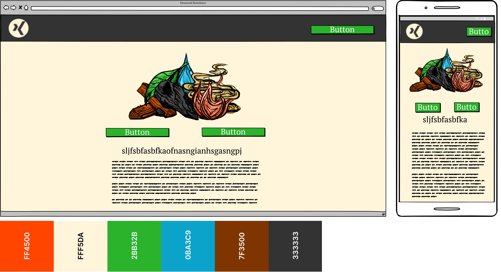
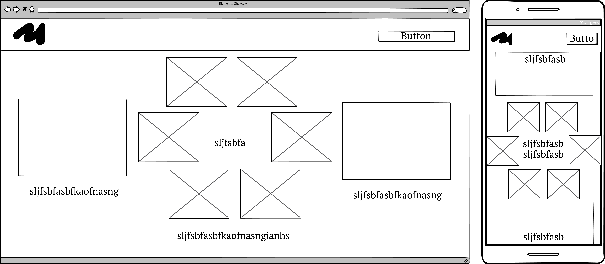
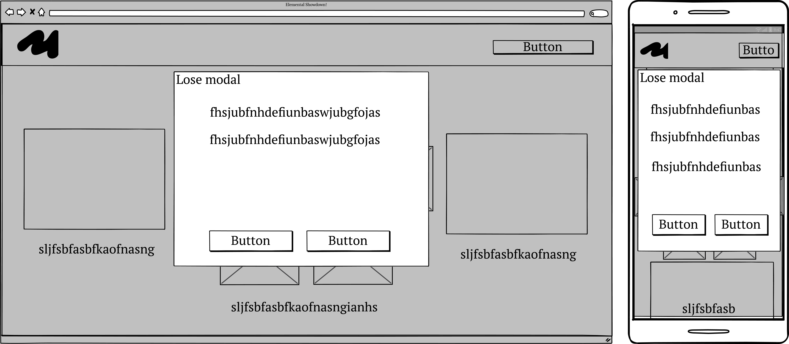
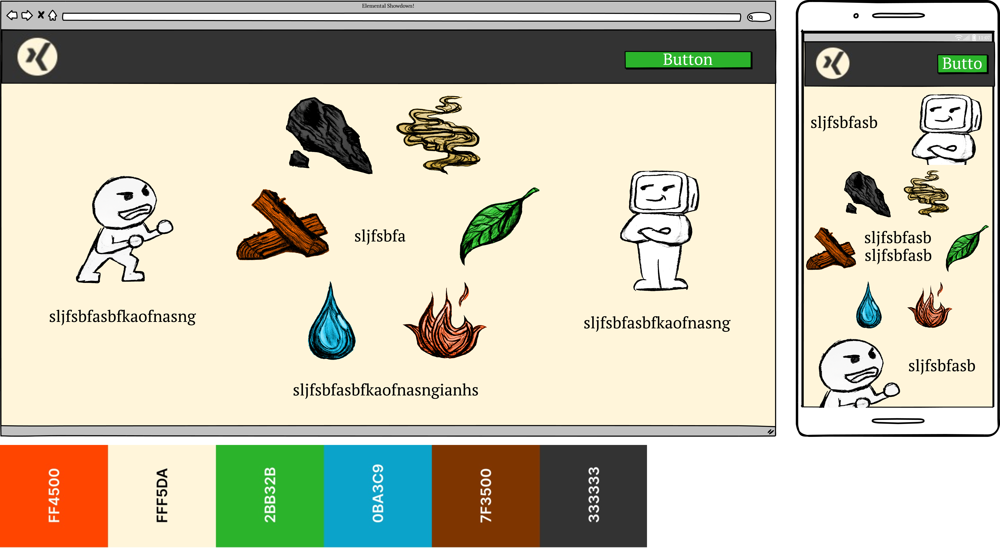
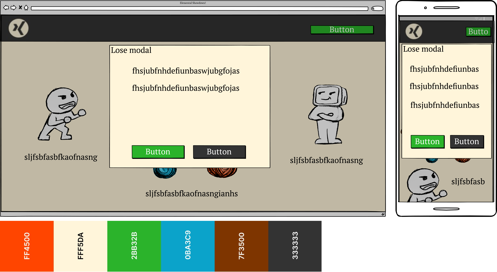

# Elemental Showdown

For the Code Institute Bootcamp Hackathon #2, our team decided to complete the rock paper scissors game with a twist. Our player chooses between 6 different options based on the traditional chinese elements to play against the Singularity (our computer's randomly selected move) in a bes of 3 battle of the Elements!

## Features 

### User stories

- Sitewide

    - As a user I want a clickable logo in the header so that I can easily navigate back to the landing page

    - As a user I want there to be a background music toggle so that I can listen to something which fits the game as I play it

    - As a user I want a sound effects toggle so that I can turn off the in game sounds at the click of a button

    - As a user I want to be able to hear some fitting background music so that I can get more into the game I’m playing

- Landing page 

    - As a user I want to see the rules of the game clearly on the landing page so that I can learn them quickly and start playing as soon as I understand them

    - As a user I want to be able to start the game from the landing page so that I can play it faster

    - As a user I want  to be able to play the game without entering any information so that I can start playing instantly

    - As a user I want to be able to sign in to the game with a name so that I can choose to play as myself or some other person/character for fun

- Game

    - As a user I want to be able to choose what element I want to use for each round so that I can have an impact on the game

    - As a user I want so that I can

    - As a user I want to be able to see the winner of every round so that I can understand what has happened in the game

    - As a user I want see how many rounds the player and computer have won so that I can see who is about to win

    - As a user I want to be able to see the current round number so that I can keep track of how far into the best of three I am

    - As a user I want to see the winner of each round as it ends so that I can gain more of an understanding of what’s happening in the game

    - As a user I want to hear sound effects for every element in the battle so that I can be more immersed

    - As a user I want to have to make a decision on what element I want to use within a 5 second time limit so that the game can feel more intense
    
    - As a user I want to be able to see how many best of 3 battles I've won so that I can keep track of my achievements

As a user I want to see the move I’ve selected going up against the move the computer has selected so that I can see for myself if I’ve won the round or not 

- Game end

    - As a user I want to see a message at the end of the best of 3 so that I can see if I’ve won or not

    - As a user I want there to be a button on the endgame screen to play again so that I can continue playing with just one click

    - As a user I want to see the name I’ve used to sign in referenced on the endgame screen so that I can be more invested in the outcome of the game

    - As a user I want there to be a button on the endgame screen to return to the landing page so that I can return there with just one click

    - As a user I want a score to be calculated from my performance so that I can easily see an idea of how I've done

    - As a user I want to see a breakdown of my performance with data shown so that I can see bespoke feedback on how I've done 

- Footer

    - As the site owner I want there to be a footer with my copyright so that I can protect my IP

    - As a user I want there to be a rules pop up on the footer so that I can check the rules of the game again as I’m playing

### MoSCoW Table

## Wireframes

- __Landing page__

- 

- 

- __Game page__

- 

- 

- 

- 

### Existing Features

### Features We'd implement in the future if we could

## Testing 

### Feature Testing

### Validator Testing 

### Identified Bugs

## Deployment

https://elemental-showdown.netlify.app

## Credits 

### Content 

### Media