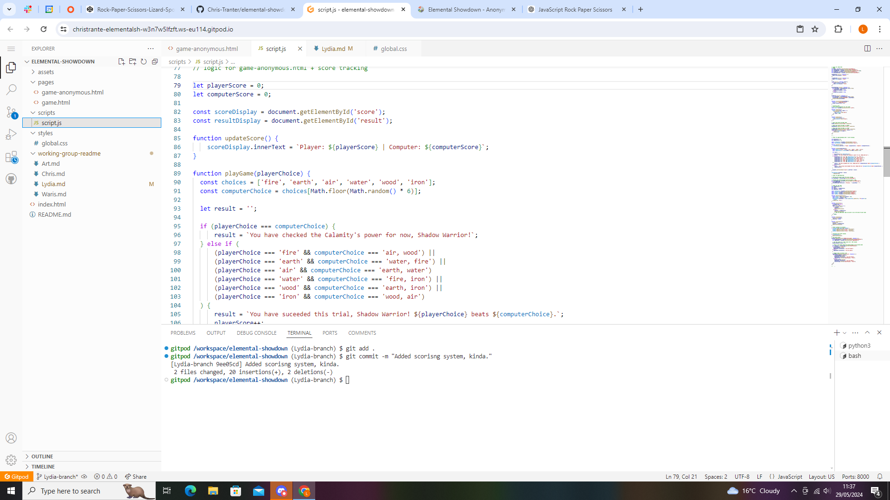

Added in the basic code for a Rock, Paper, Scissors game and then adjusted it to work for the Elemental Showdown

Helped adjust the original code to better suit the needs of the game before it was used as a seperate basis for the version of the code we used.

Started working on the timer that would time the rounds and make a nosie if time ran out. this was put off as something we could do later on and as an extra feature that might be added if we had more time.