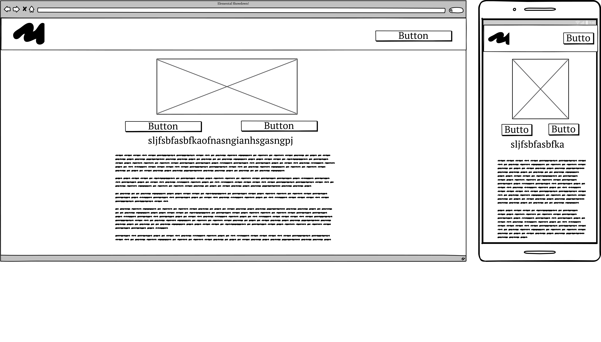
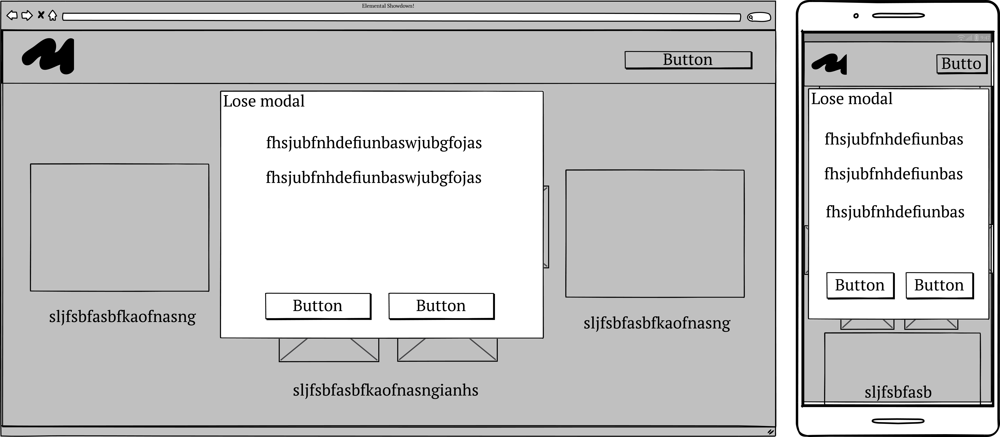

# 28/05/24 
Helped set up kanban board
Made list of features we'd like to include and wrote them as user stories
Added read me template
Made lofi wireframes
Moscow sorted the features
# 29/05/24
Created assets for game (pictures for elements)
Add skeleton modal for end of anonymous game, displaying a score 
Altered modal to fulfil MVP (only display the winner of the best of 3, no score)  
Found new bg music at https://pixabay.com/music/world-the-chinese-modern-143818/
Made moscow table
Added completed modal for end of signed in game
# 30/05/24 
Fixed music on every page

# Elemental Showdown

For the Code Institute Bootcamp Hackathon #2, our team decided to complete the...

## Features 

### User stories

Sitewide - header - must do - As a user I want a clickable logo in the header so that I can easily navigate back to the landing page

Sitewide - music toggle - should do - As a user I want there to be a background music toggle so that I can listen to something which fits the game as I play it

Sitewide - sound effects toggle - should do - As a user I want a sound effects toggle so that I can turn off the in game sounds at the click of a button

Sitewide - find background music .mp3 - should do - As a user I want to be able to hear some fitting background music so that I can get more into the game I’m playing

Landing page - rules - must do - As a user I want to see the rules of the game clearly on the landing page so that I can learn them quickly and start playing as soon as I understand them

Landing page - start game - must do - As a user I want to be able to start the game from the landing page so that I can play it faster

Landing page - anonymous sign in - must do - As a user I want  to be able to play the game without entering any information so that I can start playing instantly

Landing page - name sign in - should do - As a user I want to be able to sign in to the game with a name so that I can choose to play as myself or some other person/character for fun

Game - user move selection - must do - As a user I want to be able to choose what element I want to use for each round so that I can have an impact on the game

Game - timer for making a decision - must do - As a user I want so that I can

Game - display winner after every move - should do - As a user I want to be able to see the winner of every round so that I can understand what has happened in the game

Game - display number of rounds won - should do - As a user I want see how many rounds the player and computer have won so that I can see who is about to win

Game - display current round number - should do - As a user I want to be able to see the current round number so that I can keep track of how far into the best of three I am

Game - display winner after every move - should do - As a user I want to see the winner of each round as it ends so that I can gain more of an understanding of what’s happening in the game

Game - Sounds for each element and button clicks - could do - As a user I want to hear sound effects for every element in the battle so that I can be more immersed

Game - Display of users move against CPU move (sound effect) - could do - As a user I want to see the move I’ve selected going up against the move the computer has selected so that I can see for myself if I’ve won the round or not 

Game end - display a message on game end - must do - As a user I want to see a message at the end of the best of 3 so that I can see if I’ve won or not

Game end - button to try again - must do
As a user I want there to be a button on the endgame screen to play again so that I can continue playing with just one click

Game end - mention signed in user on game end - should do
As a user I want to see the name I’ve used to sign in referenced on the endgame screen so that I can be more invested in the outcome of the game

Game end - button on defeat links to homepage - could do
As a user I want there to be a button on the endgame screen to return to the landing page so that I can return there with just one click

Footer - copyright - must do
As the site owner I want there to be a footer with my copyright so that I can protect my IP

Footer - Rules pop up - should do
As a user I want there to be a rules pop up on the footer so that I can check the rules of the game again as I’m playing

### MoSCoW Table

## Wireframes

- __Landing page__

- 

- __Game page__

- 

- 

### Existing Features

### Features We'd implement in the future if we could

## Testing 

### Feature Testing

### Validator Testing 

### Identified Bugs

## Deployment

## Credits 

### Content 

### Media

