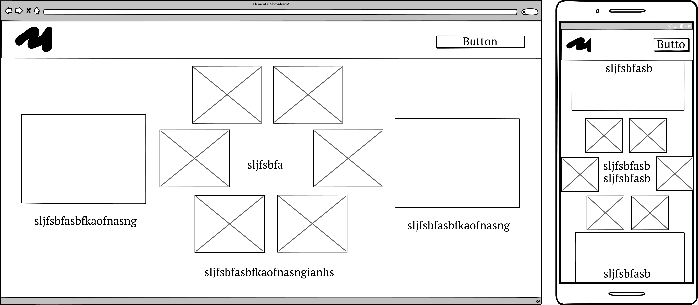

# Horror art portfolio

For the Code Institute Bootcamp Hackathon #2, our team decided to complete the...

## Features 

### User stories

### MoSCoW Table

## Wireframes

- __Landing page__

- 

- __Game page__

- 

- 

### Existing Features

### Features We'd implement in the future if we could

## Testing 

### Feature Testing

### Validator Testing 

### Identified Bugs

## Deployment

## Credits 

### Content 

### Media

